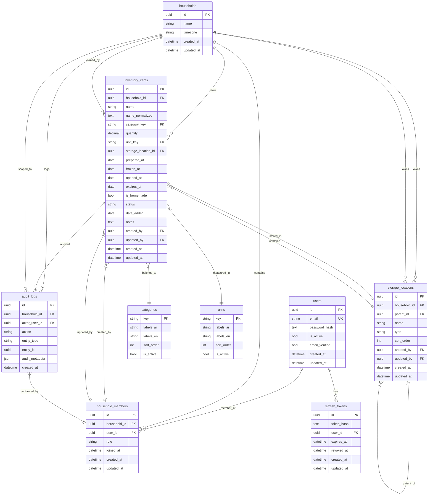

# Entity Relationship Diagram (ERD)

## Relationship Summary

| Parent | Child | Cardinality | Cascade | Notes |
|--------|-------|-------------|---------|-------|
| users | household_members | 1:N | delete-orphan | User can belong to multiple households |
| users | refresh_tokens | 1:N | delete-orphan | Tokens revoked on user delete |
| households | household_members | 1:N | delete-orphan | Members removed if household deleted |
| households | inventory_items | 1:N | delete-orphan | Items deleted with household |
| households | storage_locations | 1:N | delete-orphan | Locations deleted with household |
| households | audit_logs | 1:N | delete-orphan | Logs deleted with household |
| storage_locations | storage_locations | 1:N (self) | delete-orphan | Hierarchical nesting |
| storage_locations | inventory_items | 1:N | delete-orphan | Items deleted when location deleted |
| categories | inventory_items | 1:N | RESTRICT | Cannot delete category if items exist |
| units | inventory_items | 1:N | RESTRICT | Cannot delete unit if items exist |
| household_members | inventory_items (created_by) | 1:N | SET NULL | Preserve item, clear created_by |
| household_members | inventory_items (updated_by) | 1:N | SET NULL | Preserve item, clear updated_by |
| household_members | audit_logs | 1:N | - | Actor reference |

## Key Constraints

- **household_members**: Unique(household_id, user_id) - one membership per user per household
- **inventory_items**: quantity > 0, notes ≤ 500 chars, status ∈ {stored, thawing, consumed, discarded}
- **Cross-household isolation**: All queries filter by household_id from JWT
- **Reference data (categories, units)**: Global, not household-scoped
- **Bilingual labels**: categories.labels = {"ar": "...", "en": "..."} (JSON), same for units

## Indexes (Performance)

| Table | Index |
|-------|-------|
| users | email (unique) |
| refresh_tokens | user_id, expires_at |
| household_members | (household_id, user_id) unique |
| inventory_items | household_id, storage_location_id |
| inventory_items | household_id, category_key |
| inventory_items | household_id, category_key, storage_location_id |
| inventory_items | household_id, created_at |
| storage_locations | household_id, parent_id |
| audit_logs | household_id, entity_type, entity_id |
| audit_logs | created_at |