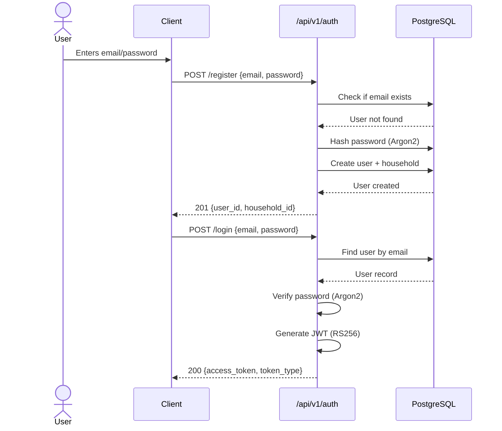
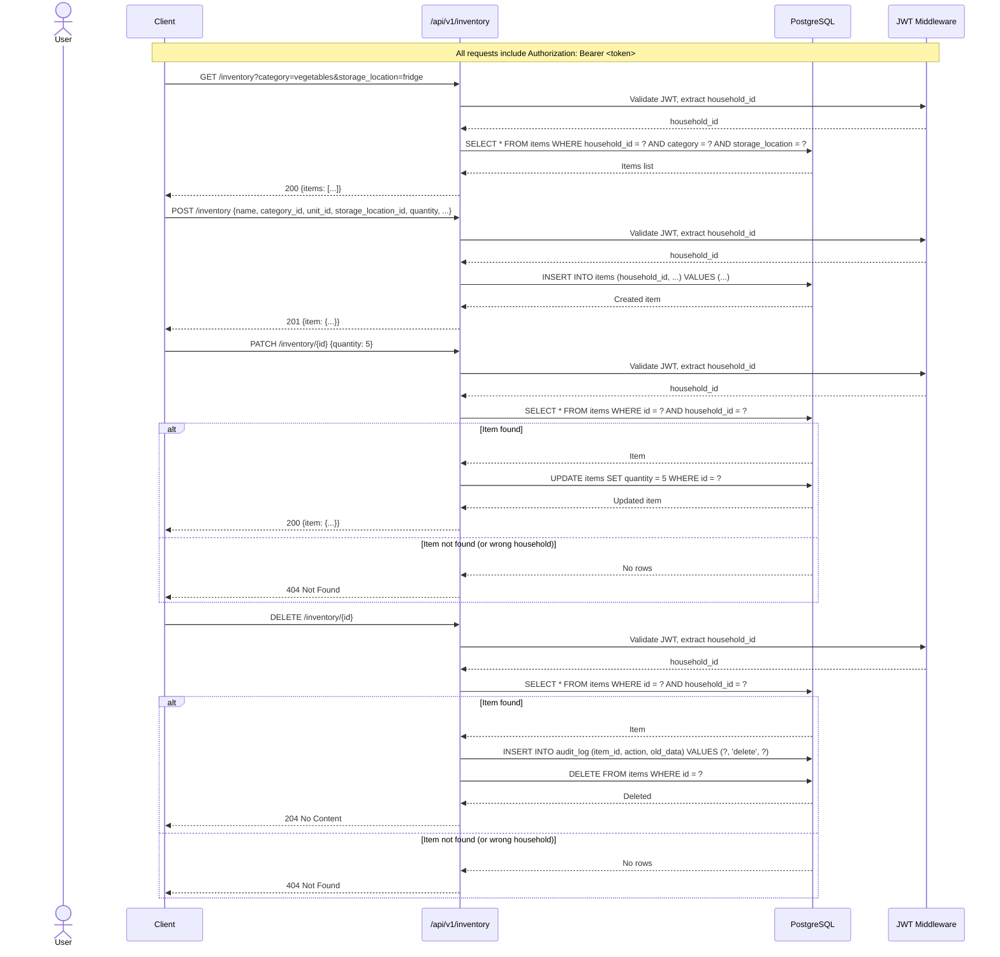
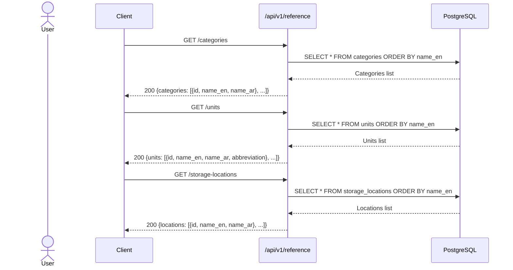
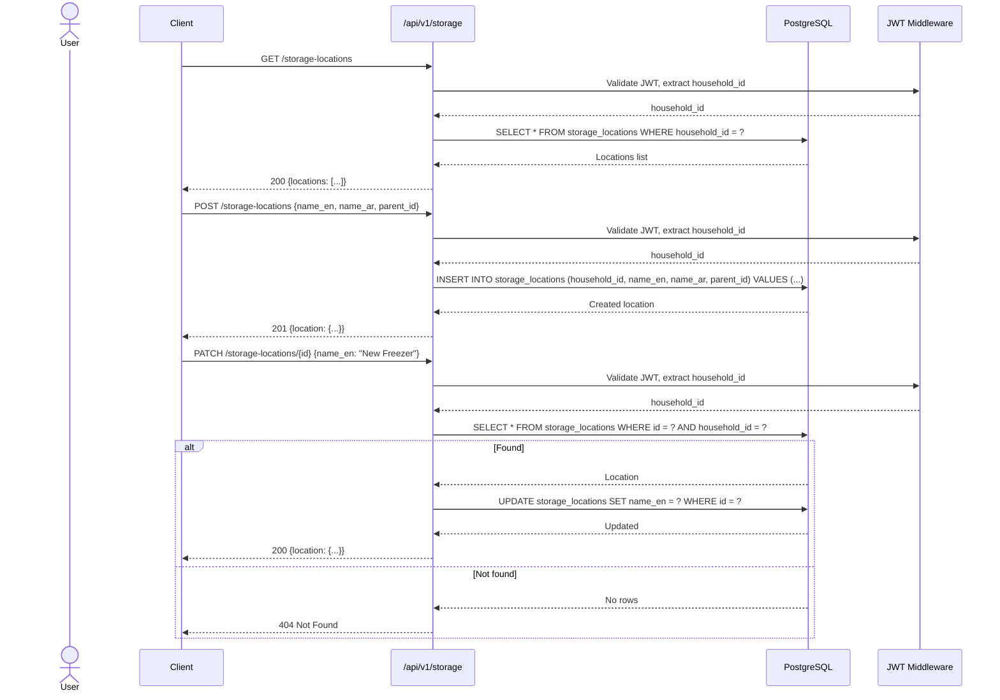
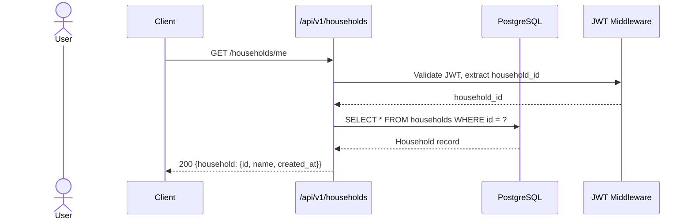
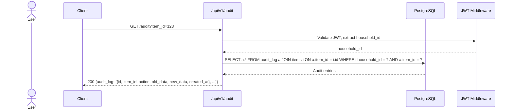
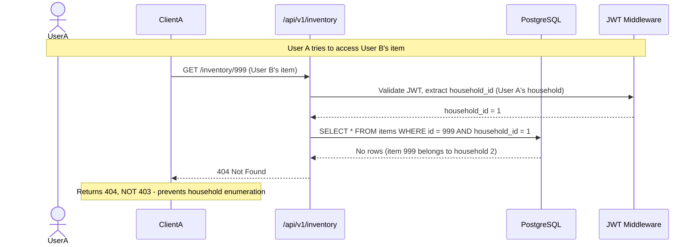

# API Sequence Diagrams

## Authentication Flow

## Inventory CRUD Flow

## Reference Data Flow

## Storage Location Management Flow

## Household Info Flow

## Audit Log Flow

## Error Handling: Cross-Household Isolation

